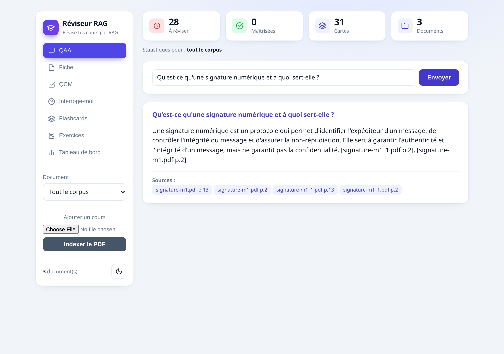
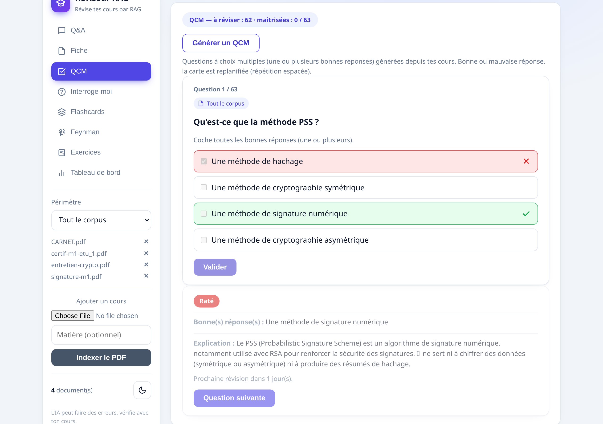
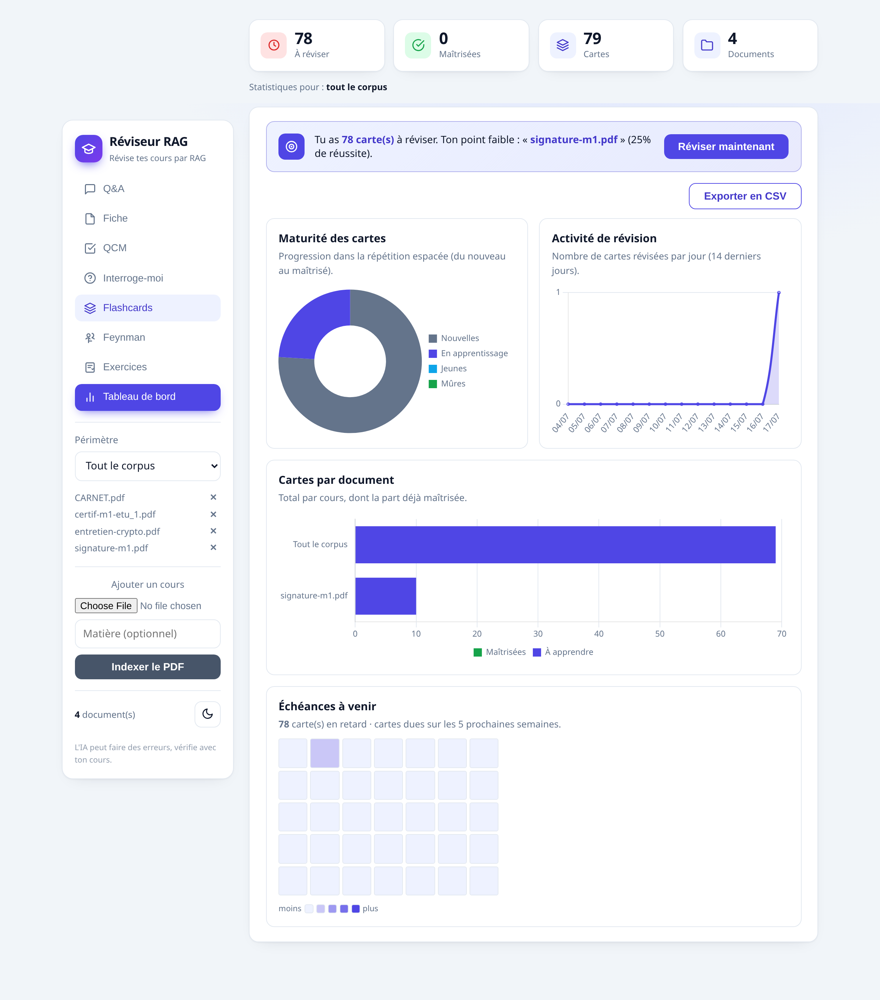
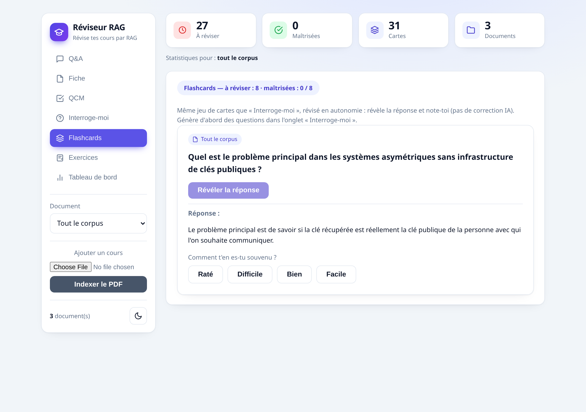
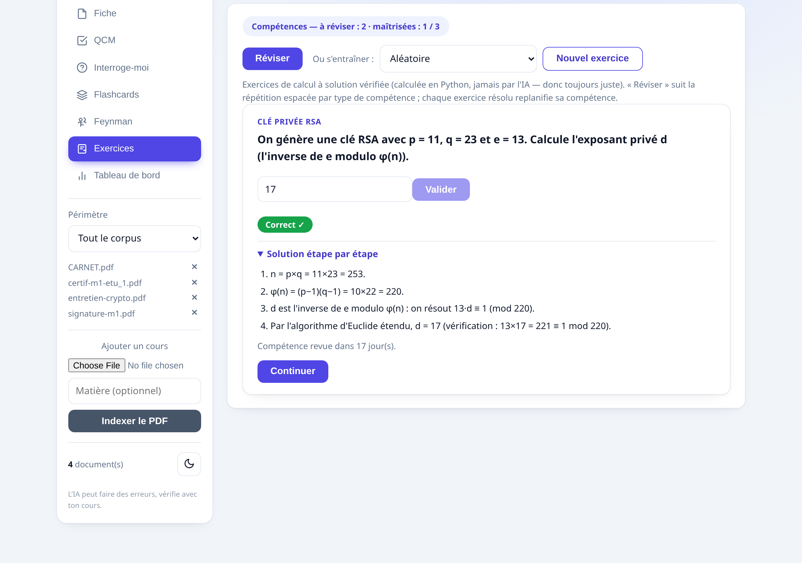
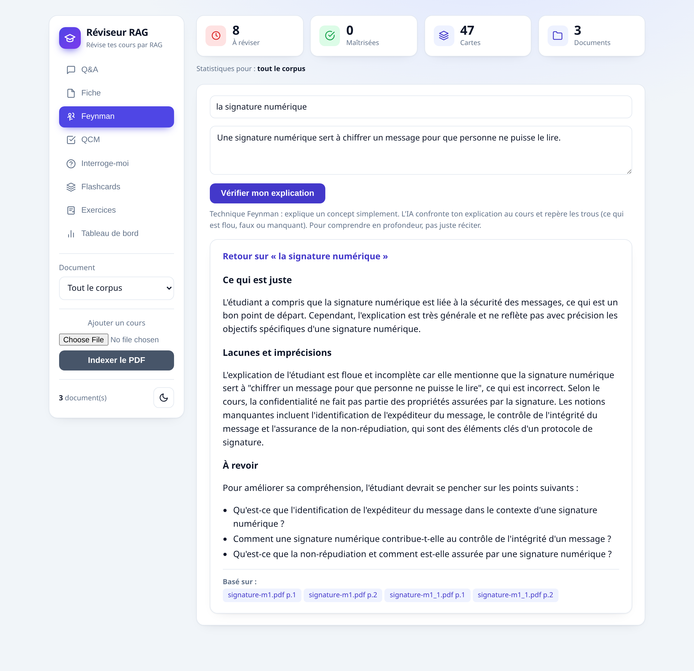

# Réviseur RAG

Un assistant de révision qui lit des cours en PDF et interroge dessus. Trois usages principaux : poser une question et obtenir une réponse sourcée, générer une fiche de synthèse, ou se faire interroger en répétition espacée (le système pose les questions, corrige les réponses et reprogramme chaque carte selon ce qu'on retient).

Le but n'est pas juste de retrouver une information (un chatbot le fait déjà), mais de la mémoriser : les questions sont générées depuis les documents fournis, les réponses libres sont corrigées par l'IA, et la révision suit un planning type Anki.

## Aperçu

| Q&A sourcé | QCM corrigé | Tableau de bord |
|:---:|:---:|:---:|
|  |  |  |

| Flashcards | Exercices (calcul vérifié) | Feynman |
|:---:|:---:|:---:|
|  |  |  |

*Captures régénérables avec `python capture_screenshots.py` (app lancée + Chromium Playwright).*

## Fonctionnalités

- **Q&A** : on pose une question en langage naturel, l'app répond à partir des passages les plus proches avec des citations ancrées : chaque affirmation porte un marqueur [n] cliquable qui déplie le passage exact (fichier + page) dont elle est tirée. Seuls les passages réellement cités sont listés en sources.
- **Fiche** : synthèse structurée d'un document (idées clés, définitions, à retenir, questions d'auto-test).
- **Feynman** : on explique un concept avec ses propres mots, l'IA confronte l'explication au cours et pointe ce qui est flou, faux ou manquant, avec des pistes à revoir. L'idée est de tester la compréhension, pas juste le rappel.
- **Interroge-moi** : le système génère des cartes question/réponse, interroge, note la réponse de 0 à 5 (correction par l'IA) et la replanifie avec l'algorithme SM-2.
- **QCM** : questions à choix multiples générées depuis les cours, avec une ou plusieurs bonnes réponses (cases à cocher, correction tout-ou-rien) et une explication systématique (pourquoi la bonne est correcte, pourquoi les autres sont fausses). Bonne réponse, la carte est espacée ; mauvaise, elle revient dès le lendemain (même planning SM-2).
- **Flashcards** : même jeu de cartes que « Interroge-moi », révisé en autonomie. On révèle la réponse et on s'auto-note (Raté / Difficile / Bien / Facile), sans appel à l'IA. La note alimente le SM-2.
- **Exercices** : exercices de calcul cryptographique (vérification de signature RSA, exponentiation modulaire, calcul de l'exposant privé), générés avec des nombres aléatoires et **corrigés en Python**, jamais par l'IA. La solution est donc toujours juste, avec le détail étape par étape. Ce mode vise l'applicatif, là où générer depuis les PDF ne donnerait que de la théorie. La répétition espacée s'applique ici par type de compétence : chaque exercice résolu replanifie sa compétence, et « Réviser » propose celle arrivée à échéance.
- **Tableau de bord** : statistiques de révision (maturité des cartes, activité par jour, répartition par document, heatmap des échéances), filtrables par document. En haut, une bande de recommandation diagnostique le deck (cartes en retard, document le plus faible) et propose un bouton qui lance la révision ciblée. Ce diagnostic se fait par règles simples, sans appel à l'IA.

## Comment ça marche

Le pipeline RAG (Retrieval-Augmented Generation) :

1. **Découpage** : chaque PDF est lu avec `pypdf` et coupé en passages d'environ 800 mots, avec 150 mots de recouvrement pour ne pas perdre le fil entre deux passages.
2. **Indexation** : chaque passage est encodé en vecteur avec le modèle `all-MiniLM-L6-v2` (sentence-transformers). L'index est mis en cache sur disque (`index_cache.json` + `index_cache.npz`, authentifiés par une signature HMAC), donc seuls les fichiers modifiés sont réencodés.
3. **Recherche** : la question est comparée aux passages par deux voies (similarité cosinus sur les vecteurs, et BM25 sur les mots exacts), fusionnées par Reciprocal Rank Fusion. Les 20 meilleurs candidats sont ensuite relus un par un par un cross-encoder (`mmarco-mMiniLMv2-L12-H384-v1`), qui départage plus finement que la comparaison de vecteurs ; les 4 meilleurs forment le contexte.
4. **Génération** : les passages sont numérotés puis envoyés à un modèle Groq (`openai/gpt-oss-120b`) qui rédige la réponse en français en citant chaque affirmation par son numéro [n]. Le serveur ne garde comme sources que les numéros réellement cités dans la réponse (avec repli sur tous les passages récupérés si le modèle n'en cite aucun), et l'interface rend chaque marqueur cliquable vers le passage exact.

Pour la répétition espacée, chaque carte garde son état SM-2 (facilité, intervalle, prochaine échéance) dans une base SQLite. La note de 0 à 5 met à jour cet état : si la réponse est bonne, l'intervalle s'allonge ; si elle est mauvaise, la carte revient dès le lendemain. Seules les cartes arrivées à échéance sont proposées à la révision. Chaque révision est aussi journalisée (table `reviews`), ce qui alimente la courbe d'activité du tableau de bord. Les graphes sont rendus côté client avec Chart.js, la heatmap des échéances en CSS pur.

## Installation

Python 3.10+.

```bash
python -m venv venv
source venv/bin/activate
pip install -r requirements.txt
```

Copie `.env.example` en `.env` et renseigne ta clé Groq (gratuite sur console.groq.com) :

```
GROQ_API_KEY=ta_cle_ici
```

## Lancement

```bash
python app.py
```

L'interface est sur http://127.0.0.1:5000. Au premier démarrage, le modèle d'embeddings (~80 Mo) est téléchargé. Ajoute tes PDF via le bouton « Ajouter un PDF », ou place-les directement dans le dossier `docs/`.

Une version ligne de commande existe aussi :

```bash
python chatbot.py
```

### Avec Docker

```bash
docker build -t reviseur-rag .
docker run -p 5000:5000 -e GROQ_API_KEY=ta_cle_ici reviseur-rag
```

Le modèle d'embeddings est téléchargé pendant le build, donc le conteneur démarre vite. Pour conserver tes PDF et tes cartes entre deux lancements, monte le dossier `docs/` et la base SQLite (crée d'abord le fichier vide, sinon Docker monterait un dossier à sa place) :

```bash
touch revision.db
docker run -p 5000:5000 -e GROQ_API_KEY=ta_cle_ici \
  -v "$(pwd)/docs:/app/docs" \
  -v "$(pwd)/revision.db:/app/revision.db" \
  reviseur-rag
```

## Tests

```bash
pytest
```

Les tests couvrent l'algorithme SM-2 (calcul des intervalles, réinitialisation après un échec, plancher du facteur de facilité, validation des notes), la persistance SQLite (cartes, planning, compétences) et les solveurs d'exercices (réponses recalculées et vérifiées).

## Structure

- `app.py` : serveur Flask, endpoints JSON
- `rag_engine.py` : moteur RAG (index, recherche, orchestration des modes de révision)
- `chatbot.py` : lecture PDF, embeddings, appels au modèle, et version ligne de commande
- `scheduler.py` : algorithme de répétition espacée SM-2 (fonction pure, testée)
- `exercises.py` : générateurs d'exercices de calcul crypto à solution vérifiée (déterministe, sans LLM)
- `store.py` : persistance SQLite des cartes et de leur planning
- `templates/index.html` : interface web

## Limites connues

- La recherche se fait en mémoire avec numpy : suffisant pour quelques documents, mais à remplacer par un index vectoriel dédié (FAISS) si le corpus grossit.
- Pas d'authentification ni de comptes : le projet est pensé pour un usage local.

## Licence

Sous licence MIT, voir [LICENSE](LICENSE).
