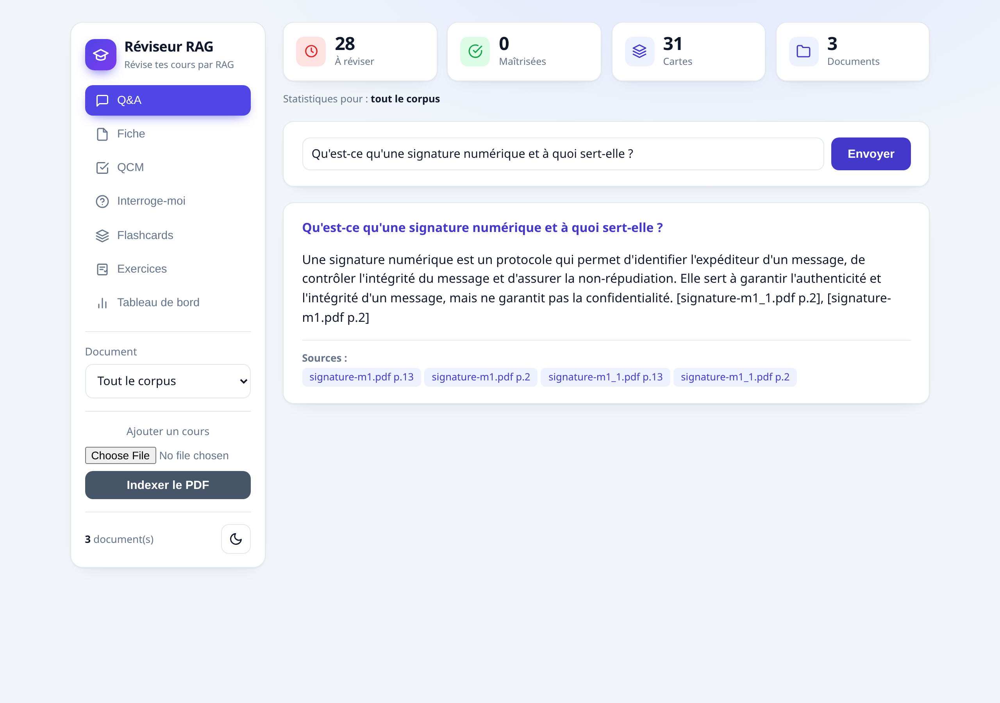
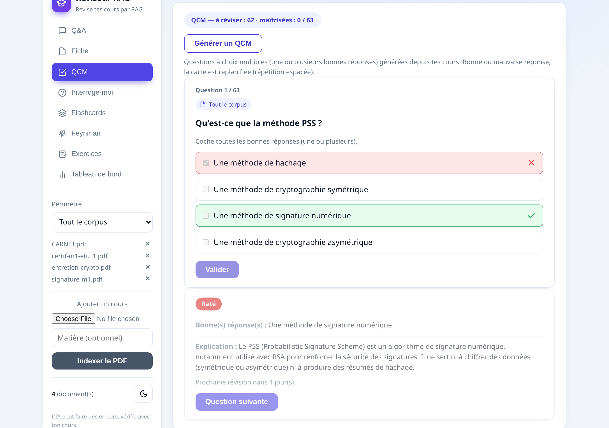
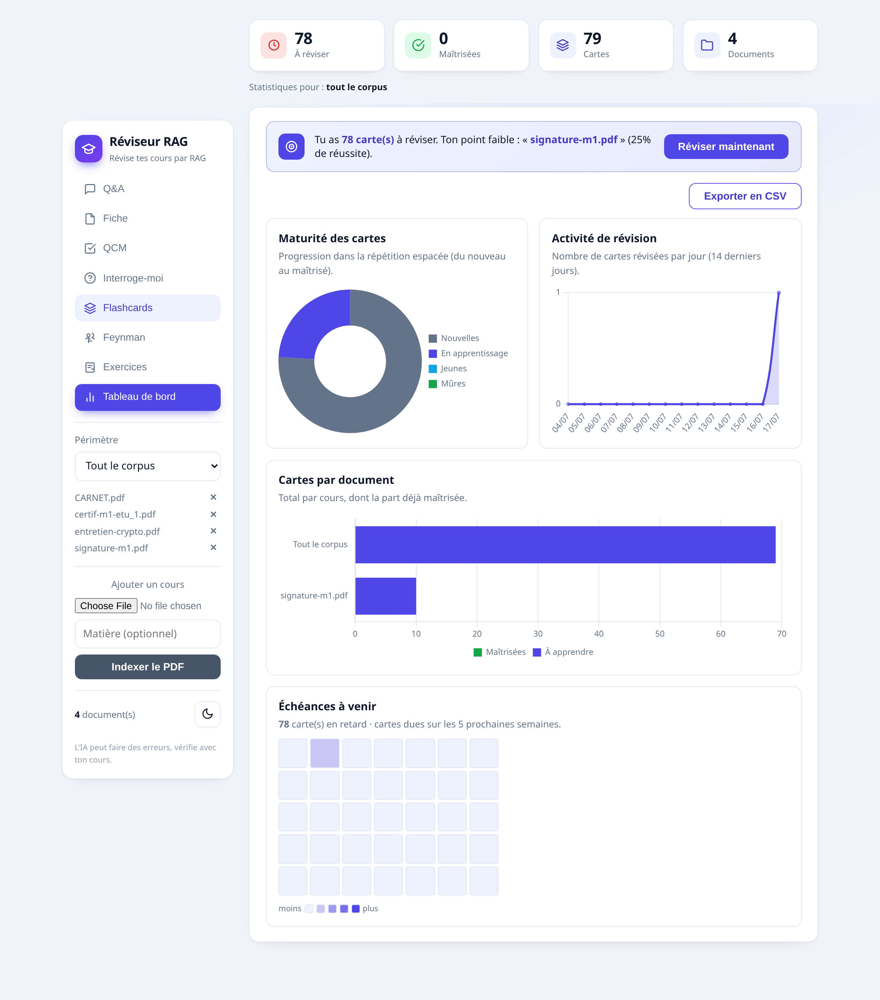
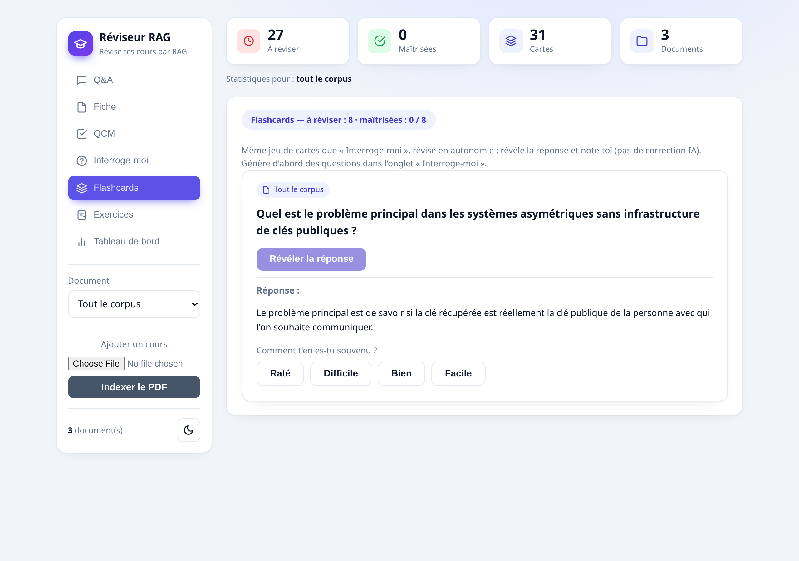
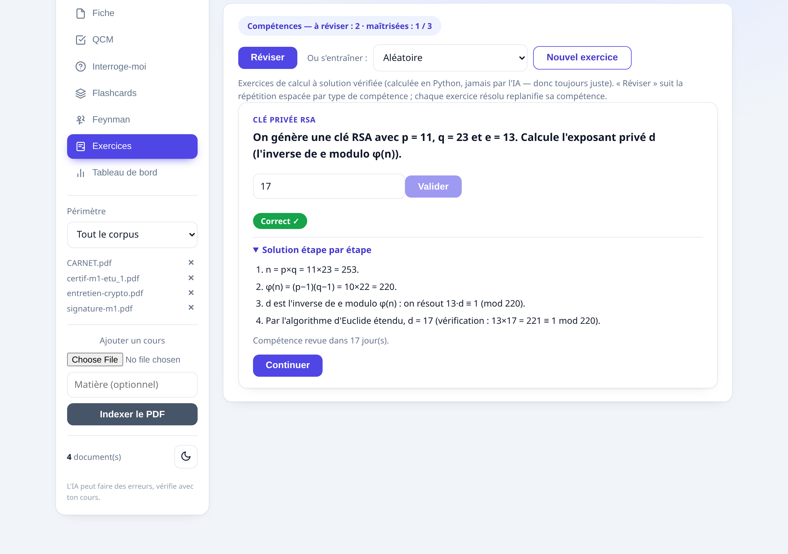
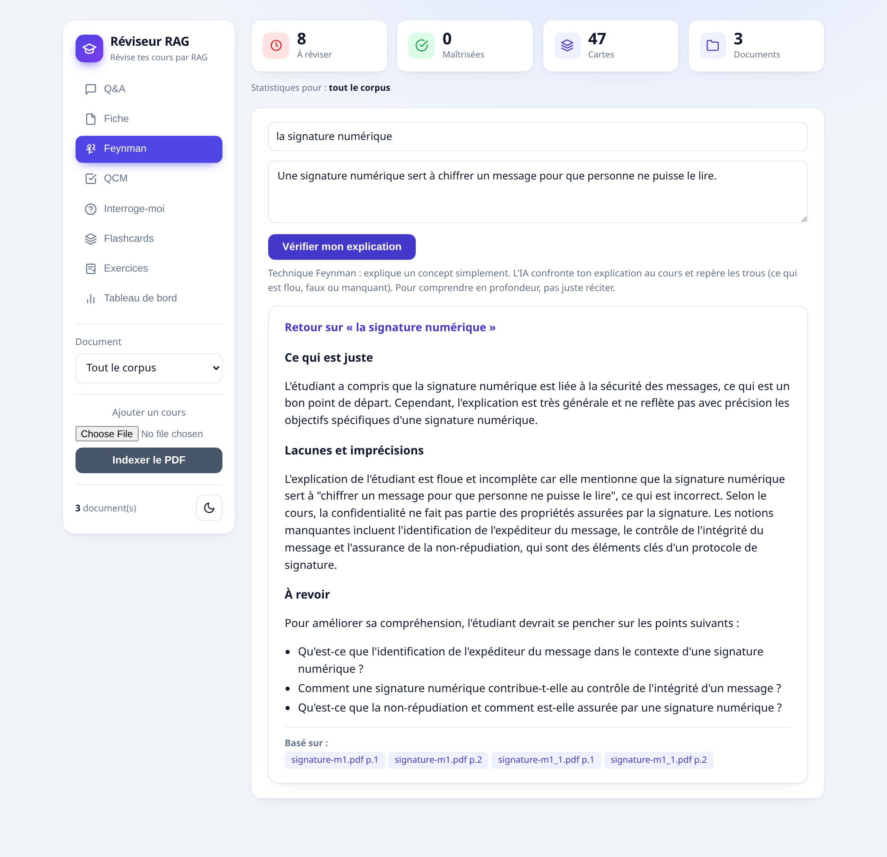

# Réviseur RAG

Un assistant de révision qui lit des cours en PDF et interroge dessus. Trois grandes familles d'usage, déclinées en plusieurs modes ci-dessous : poser une question et obtenir une réponse sourcée, générer une fiche de synthèse, ou se faire interroger en répétition espacée (le système pose les questions, corrige les réponses et reprogramme chaque carte selon ce qu'on retient).

Le but n'est pas juste de retrouver une information (un chatbot le fait déjà), mais de la mémoriser : les questions sont générées depuis les documents fournis, les réponses libres sont corrigées par l'IA, et la révision suit un planning type Anki.

> 🔒 **Sécurité** : revue de sécurité en 8 points, toutes corrigées ; modèle de menace et limites documentés dans **[SECURITY.md](SECURITY.md)**.

## Aperçu

| Q&A sourcé | QCM corrigé | Tableau de bord |
|:---:|:---:|:---:|
|  |  |  |

| Flashcards | Exercices (calcul vérifié) | Feynman |
|:---:|:---:|:---:|
|  |  |  |

*Captures régénérables avec `python capture_screenshots.py` (app lancée + Chromium Playwright).*

## Fonctionnalités

- **Q&A** : on pose une question en langage naturel, la réponse s'affiche au fil de sa génération (streaming) au lieu d'un temps d'attente sec, avec des citations ancrées : chaque affirmation porte un marqueur [n] cliquable qui déplie le passage exact (fichier + page) dont elle est tirée. Seuls les passages réellement cités sont listés en sources.
- **Fiche** : synthèse structurée d'un document (idées clés, définitions, à retenir, questions d'auto-test).
- **Feynman** : on explique un concept avec ses propres mots, l'IA confronte l'explication au cours et pointe ce qui est flou, faux ou manquant, avec des pistes à revoir. L'idée est de tester la compréhension, pas juste le rappel.
- **Interroge-moi** : le système génère des cartes question/réponse, interroge, note la réponse de 0 à 5 (correction par l'IA) et la replanifie avec l'algorithme SM-2.
- **QCM** : questions à choix multiples générées depuis les cours, avec une ou plusieurs bonnes réponses (cases à cocher, correction tout-ou-rien) et une explication systématique (pourquoi la bonne est correcte, pourquoi les autres sont fausses). Bonne réponse, la carte est espacée ; mauvaise, elle revient dès le lendemain (même planning SM-2).
- **Flashcards** : même jeu de cartes que « Interroge-moi », révisé en autonomie. On révèle la réponse et on s'auto-note (Raté / Difficile / Bien / Facile), sans appel à l'IA. La note alimente le SM-2.
- **Exercices** : exercices de calcul cryptographique (vérification de signature RSA, exponentiation modulaire, calcul de l'exposant privé), générés avec des nombres aléatoires et **corrigés en Python**, jamais par l'IA. La solution est donc toujours juste, avec le détail étape par étape. Ce mode vise l'applicatif, là où générer depuis les PDF ne donnerait que de la théorie. La répétition espacée s'applique ici par type de compétence : chaque exercice résolu replanifie sa compétence, et « Réviser » propose celle arrivée à échéance.
- **Examen blanc** : un sujet tiré au hasard (QCM, questions ouvertes, un ou deux exercices de calcul). On répond à tout, chrono affiché, correction et note sur 20 à la fin. Les réponses comptent dans la répétition espacée comme une révision normale, et la note est gardée pour suivre la progression.
- **Tableau de bord** : statistiques de révision (maturité des cartes, activité par jour, répartition par document et par notion, notes d'examen, heatmap des échéances), filtrables par document. En haut, une bande de recommandation diagnostique le deck (cartes en retard, document le plus faible) et propose un bouton qui lance la révision ciblée. Ce diagnostic se fait par règles simples, sans appel à l'IA.

## Comment ça marche

Le pipeline RAG (Retrieval-Augmented Generation) :

1. **Découpage** : chaque PDF est lu avec `pypdf`. Quand des titres de section numérotés sont détectés (ex. `3. EUF-CMA — la sécurité d'une signature`), le texte est découpé par section et chaque passage est préfixé par son titre, qui devient un repère de contexte à la fois pour la recherche et pour la réponse. À défaut de titres (slides, PDF sans structure), on retombe sur un découpage par passages d'environ 800 mots avec 150 mots de recouvrement.
2. **Indexation** : chaque passage est encodé en vecteur avec le modèle `all-MiniLM-L6-v2` (sentence-transformers). L'index est mis en cache sur disque en formats non exécutables (`index_cache.json` + `index_cache.npz` chargé avec `allow_pickle=False`), authentifiés par une signature HMAC-SHA256 : si elle ne correspond pas, le cache est rejeté et reconstruit depuis les PDF. Seuls les fichiers modifiés sont réencodés.
3. **Recherche** : la question est comparée aux passages par deux voies (similarité cosinus sur les vecteurs, et BM25 sur les mots exacts), fusionnées par Reciprocal Rank Fusion. Les 20 meilleurs candidats sont ensuite relus un par un par un cross-encoder (`mmarco-mMiniLMv2-L12-H384-v1`), qui départage plus finement que la comparaison de vecteurs ; les 4 meilleurs forment le contexte.
4. **Génération** : les passages sont numérotés puis envoyés à un modèle Groq (`openai/gpt-oss-120b`) qui rédige la réponse en français en citant chaque affirmation par son numéro [n]. Le texte est streamé au fil de sa génération (SSE) plutôt qu'attendu en bloc. Une fois la réponse complète, le serveur ne garde comme sources que les numéros réellement cités (avec repli sur tous les passages récupérés si le modèle n'en cite aucun), et l'interface rend chaque marqueur cliquable vers le passage exact.

Pour la répétition espacée, chaque carte garde son état SM-2 (facilité, intervalle, prochaine échéance) dans une base SQLite. La note de 0 à 5 met à jour cet état : si la réponse est bonne, l'intervalle s'allonge ; si elle est mauvaise, la carte revient dès le lendemain. Seules les cartes arrivées à échéance sont proposées à la révision. Chaque révision est aussi journalisée (table `reviews`), ce qui alimente la courbe d'activité du tableau de bord. Les graphes sont rendus côté client avec Chart.js, la heatmap des échéances en CSS pur.

## Évaluation

`eval_recall.py` mesure la recherche sur des questions d'un vrai contrôle de crypto
(non versionnées, propriété de l'enseignant). Pour chacune, j'ai annoté à la main le
document et la page qui contiennent la réponse. Le recall@4 vérifie si ce passage
figure dans les 4 que le moteur retourne.

Sur les 10 questions, 7 avaient une réponse dans le corpus indexé. Les 3 autres
demandaient un raisonnement, ou portaient sur une notion absente du cours. Pour ces 7
questions, le recall@4 est de 7/7, et ce pour les trois variantes du moteur (vecteurs
seuls, + BM25, + re-ranker). Mon corpus (cinq cours, cinq sujets distincts) est trop
petit pour les départager. Côté génération, le système a répondu à 5 des 10 questions
et a refusé les 5 autres sans jamais inventer, conformément à la consigne du prompt.

## Installation

Python 3.10+.

```bash
python -m venv venv
source venv/bin/activate
pip install -r requirements.txt
```

Copiez `.env.example` en `.env` et renseignez votre clé Groq (gratuite sur console.groq.com) :

```
GROQ_API_KEY=votre_cle_ici
```

## Lancement

```bash
python app.py
```

L'interface est sur http://127.0.0.1:5000. Au premier démarrage, le modèle d'embeddings (~80 Mo) est téléchargé. Ajoutez vos PDF via le bouton « Ajouter un PDF », ou placez-les directement dans le dossier `docs/`.

Pour lire vos cours depuis un autre dossier, par exemple un dossier Google Drive synchronisé, passez son chemin dans `DOCS_DIR` :

```bash
DOCS_DIR="/chemin/vers/mes-cours" python app.py
```

Un PDF dont aucun texte n'est extractible (scan, photos de slides) est signalé « non indexé » dans la liste des documents : il est présent mais rien n'en est tiré.

### Cours scannés

Un cours photographié ne contient que des images. `ocr.py` le rend lisible par le RAG :

```bash
python ocr.py mon-cours-scanne.pdf
```

Chaque page est transcrite par un modèle de vision, mais le scan d'origine est conservé : la transcription est posée par-dessus en couche invisible. Une citation ouvre donc la vraie page, vérifiable à l'œil. Un texte reconstitué par une IA ne peut pas servir de source de vérité.

~15 s par page. La transcription est sauvegardée au fil de l'eau : relancer le script reprend où il s'était arrêté.

Une version ligne de commande existe aussi :

```bash
python chatbot.py
```

### Avec Docker

```bash
docker build -t reviseur-rag .
docker run -p 5000:5000 -e GROQ_API_KEY=votre_cle_ici reviseur-rag
```

Le modèle d'embeddings est téléchargé pendant le build, donc le conteneur démarre vite. Pour conserver vos PDF et vos cartes entre deux lancements, montez le dossier `docs/` et la base SQLite (créez d'abord le fichier vide, sinon Docker monterait un dossier à sa place) :

```bash
touch revision.db
docker run -p 5000:5000 -e GROQ_API_KEY=votre_cle_ici \
  -v "$(pwd)/docs:/app/docs" \
  -v "$(pwd)/revision.db:/app/revision.db" \
  reviseur-rag
```

## Tests

```bash
pytest
```

165 tests couvrent l'ensemble du projet : l'algorithme SM-2 (calcul des intervalles, réinitialisation après un échec, plancher du facteur de facilité, validation des notes), le moteur RAG (recherche, fusion des scores, sélection et citation des sources), les endpoints Flask (upload, gestion des documents, révision, examen), la lecture des PDF et le cache d'index signé, l'examen blanc, la persistance SQLite (cartes, planning, compétences) et les solveurs d'exercices (réponses recalculées et vérifiées).

Une GitHub Action lance aussi `pip-audit` chaque lundi (et à chaque modification de `requirements.txt`) : le job échoue si une dépendance a une vulnérabilité connue. Les versions sont toutes figées dans `requirements.txt`.

## Structure

- `app.py` : serveur Flask, endpoints JSON
- `rag_engine.py` : moteur RAG (index, recherche, orchestration des modes de révision)
- `chatbot.py` : lecture PDF, embeddings, appels au modèle, et version ligne de commande
- `ocr.py` : transcription des cours scannés (couche de texte invisible posée sur le PDF d'origine)
- `scheduler.py` : algorithme de répétition espacée SM-2 (fonction pure, testée)
- `exercises.py` : générateurs d'exercices de calcul crypto à solution vérifiée (déterministe, sans LLM)
- `exam.py` : examen blanc (tirage QCM + questions ouvertes + exercices, note sur 20)
- `store.py` : persistance SQLite des cartes et de leur planning
- `templates/index.html` : interface web
- `static/` : JS de l'appli et bibliothèques servies en local (vendorisées, sans CDN)

## Limites connues

- L'index vectoriel tient entièrement en mémoire (numpy) : suffisant pour quelques documents, mais à remplacer par un index dédié (FAISS) si le corpus grossit.
- Pas d'authentification ni de comptes : le projet est pensé pour un usage local.

## Licence

Sous licence MIT, voir [LICENSE](LICENSE).
